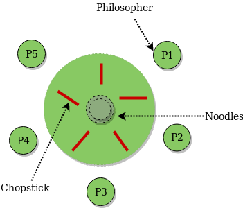

# philosophers
### A solution for the dining philosophers problem.
It goes like this. There are 5 Philosophers sitting at a round dining table. There is a bowl of rice in the middle which anyone can eat from (philosophers don’t care much for flavour) but only if they have two chopsticks. The problem is that there are only five chopsticks which are placed between each philosopher. Each philosopher can only pick up the chopsticks to their left and right. Apparently Philosophers can only eat or think. Talking is not an option for them. So you need to find a system to let everyone eat from the bowl of rice. It is also assumed that there is an infinite amount of rice in the bowl.

This project is a training to multi-threads/multi-process programming with the use of mutex and semaphore. It contains 2 different programs simulating a twist of the famous Dining Philosophers problem, all with the same basic rules.



### Lancement :
  ```
git clone https://github.com/youssefachehboune/philosophers.git && cd philosophers/philo
  ```
   ```
make && ./philo arg1 arg2 arg3 arg4 arg5
  ```
### Overview :

• Each philosopher should be a **thread**. and Each fork should be a **mutex**.
• One or more philosophers sit at a round table. There is a large bowl of spaghetti in the middle of the table.
• The philosophers alternatively eat, think, or sleep. While they are eating, they are not thinking nor sleeping; while thinking, they are not eating nor sleeping; and, of course, while sleeping, they are not eating nor thinking.
• There are also forks on the table. There are as many forks as philosophers.
• Because serving and eating spaghetti with only one fork is very inconvenient, a philosopher takes their right and their left forks to eat, one in each hand.
• When a philosopher has finished eating, they put their forks back on the table and start sleeping. Once awake, they start thinking again. The simulation stops when a philosopher dies of starvation.
• Every philosopher needs to eat and should never starve.
• Philosophers don’t speak with each other.
• Philosophers don’t know if another philosopher is about to die.
• No need to say that philosophers should avoid dying!

./philo arg1 arg2 arg3 arg4 arg5

- arg1 = number_of_philosophers The number of philosophers and also the number
of forks.
- arg2 = time_to_die (in milliseconds): If a philosopher didn’t start eating time_to_die milliseconds since the beginning of their last meal or the beginning of the simulation, they die.
- arg3 = time_to_eat (in milliseconds): The time it takes for a philosopher to eat. During that time, they will need to hold two forks.
- arg4 = time_to_sleep (in milliseconds): The time a philosopher will spend sleeping.
- arg5 = number_of_times_each_philosopher_must_eat (optional argument): If all philosophers have eaten at least number_of_times_each_philosopher_must_eat times, the simulation stops. If not specified, the simulation stops when a philosopher dies.

For more informations [Subject](/Philosophers.en.pdf).

### Test


| test | result |
|----------|-------|
| ./philo 1 800 200 200 | The philosopher should not eat and should die!|
| ./philo 5 800 200 200 | No one should die! |
| ./philo 5 800 200 200 7 | No one should die and the simulation should stop when all the philosopher has eaten at least 7 times each. |
| ./philo 4 410 200 200 | No one should die! |
| ./philo 4 310 200 100 | A philosopher should die! |
| ./philo 2 400 200 200 | A death delayed by more than 10 ms is unacceptable. |

[Correction page](/Philosophers_correction.pdf)
